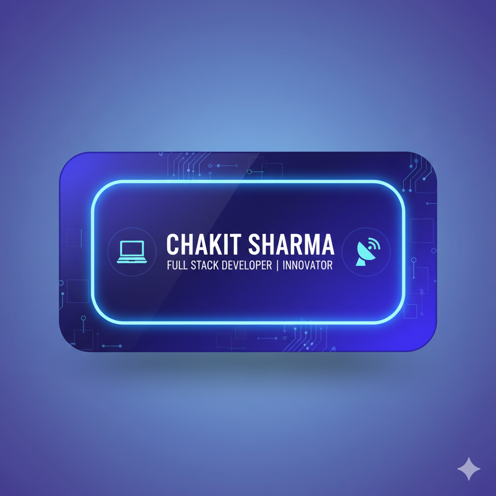

  <!-- Replace with your actual header image file -->

# 👋 Hi, I'm Chakit Sharma  

💻 Aspiring Full Stack Developer | 🚀 Ex-Intern @ iCtrlBiz Consulting | 🎓 CSE Undergrad at IMS Engineering College  

---

## 💫 About Me  
- 🎓 Pursuing **B.Tech in Computer Science** from Dr. A.P.J. Abdul Kalam Technical University (AKTU), Lucknow (2022–2026)  
- 💡 Passionate about **Full-Stack Web Development & Cloud Solutions**  
- 🌱 Currently enhancing expertise in **MERN Stack, Data Science & AWS**  
- 📊 Experienced with **React.js, Redux.js, Node.js, and Python (Data Science)**  
- 🌍 Based in **Ghaziabad, Uttar Pradesh, India**  

---

## 🏢 Experience  
**Internship Trainee – iCtrlBiz Consulting Pvt Ltd**  
*June 2025 – Aug 2025 | Noida*  
- Contributed to **React.js & Redux.js projects**, improving dynamic web apps.  
- Worked in collaborative, agile-driven environment to deliver scalable solutions.  

**Future Intern – Future Intern Program**  
*Sept 2024 – Oct 2024 | Ghaziabad*  
- Developed projects including **Rock, Paper, Scissors**, **Random Password Generator**, **Tic-Tac-Toe**, and **Expense Tracker with AI Insights**.  

**Technical Trainee – ShapeMySkills Pvt. Ltd.**  
*Jan 2024 – Mar 2024 | Ghaziabad*  
- Completed **Data Science with Python** training.  
- Gained experience in **data manipulation, visualization, and analysis**.  

---

## 🎓 Education  
- **B.Tech, Computer Science** – Dr. A.P.J. Abdul Kalam Technical University (2022–2026)  
- **Intermediate & High School** – Carmel Public School, India  

---

## 💻 Tech Stack  
**Frontend:** React.js, Redux.js, Next.js, Tailwind CSS, JavaScript  
**Backend:** Node.js, Express.js  
**Database:** MongoDB, PostgreSQL  
**Other Tools:** Git, GitHub, Postman, Firebase  
**Cloud & Data:** AWS (Solutions Architecture Certified), Python (Data Science)  

---

## 📜 Certifications  
- 🏆 **AWS APAC – Solutions Architecture Job Simulation**  
- 🏆 **React & Redux**  
- 🏆 **Data Science with Python**  

---

## 🌐 Connect with Me  
📧 Email: [chakitsharma7@gmail.com](mailto:chakitsharma7@gmail.com)  
💼 LinkedIn: [linkedin.com/in/chakitsharma](https://www.linkedin.com/in/chakitsharma)  
🌍 Portfolio: [portfolio-vert-sigma-74.vercel.app](https://portfolio-vert-sigma-74.vercel.app/)  
🐙 GitHub: [github.com/chakit07](https://github.com/chakit07)  

  
  
  

---

## 📊 GitHub Stats  
  
  
  

---

## 🚀 Quote of the Day  
  

---

✨ _"Code. Build. Innovate."_  
